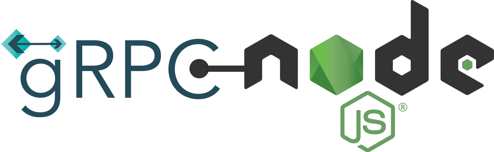

## Four Ways of Integrating gRPC into your Node.js Project

When I first started using gRPC for Node.js, I quickly became a bit overwhelmed.
There seemed to be a plethora of ways to integrate gRPC into clients and servers,
and every article I read suggested a slightly different approach.
Moreover, some of the approaches did not work at first, sometimes because of a missing flag,
sometimes because I confused local and global installations.
I was pretty demotivated.

Later on, I tried to approach the matter more systematically.
It was not hard to see the differences between dynamic and static code generation,
but it took me a little while to get an overview of the various ways to generate code, with and without types.
The more I understood, the more I wanted to write a short blog post about my findings.
And here it is!

For this blog post, I use the simplest possible protocol specification:
```protobuf
syntax = "proto3";

service Greeter {
  rpc sayHello(HelloRequest) returns (HelloReply) {}
}

message HelloRequest {
  string name = 1;
}

message HelloReply {
  string message = 1;
}
```
The client passes a simple `HelloRequest` object with a name to the server;
the server replies with a `HelloReply` object with a message `"Hello <name>"`.


### Dynamic Generation
The first way to combine gRCP and Node.js is dynamic code generation.
As the name suggests, this variant does not require a build step.
The `.proto` file is included into the target applications at runtime.
A protocol loader generates the service descriptors and client stubs on the fly.

Only two libraries are needed for creating gRPC servers and clients: 
```shell
npm install @grpc/grpc-js @grpc/proto-loader
```
A minimalist client implementation looks like this:
```javascript
const { credentials, loadPackageDefinition } = require('@grpc/grpc-js')
const protoLoader = require('@grpc/proto-loader')

const packageDef = protoLoader.loadSync('../hello.proto', {})
const packageObj = loadPackageDefinition(packageDef)

const client = new packageObj.Greeter('localhost:5005', credentials.createInsecure())
const request = { name: 'dynamic' }

client.sayHello(request, (error, response) => {
    console.log(error ? error : response.message)
})
```
The corresponding server code is:
```javascript
const { Server, ServerCredentials, loadPackageDefinition} = require('@grpc/grpc-js')
const protoLoader = require('@grpc/proto-loader')

const packageDef = protoLoader.loadSync('../hello.proto', {})
const packageObj = loadPackageDefinition(packageDef)

function sayHello(call, callback) {
    callback(null, { message: 'Hello ' + call.request.name })
}

const server = new Server()
server.addService(packageObj.Greeter.service, { sayHello })
server.bindAsync('0.0.0.0:5005', ServerCredentials.createInsecure(), (error, port) => {
    console.log(error ? error.message : 'Server listening on port ' + port)
})
```
Dynamic generations is proposed by the [gRPC home page](https://grpc.io/docs/languages/node/basics/)
and used in several articles, such as [How to Build Your First Node.js gRPC API](https://www.trendmicro.com/en_us/devops/22/f/grpc-api-tutorial.html).

A major drawback is the lack of IDE support for writing server and client code.
One solution to this problem is to generate types in advance, as outlined in section "Generating TypeScript types"
of the [gRPC Protobuf Loader](https://github.com/grpc/grpc-node/tree/master/packages/proto-loader) project description.

However, type generation _does_ require a build step, and thus a project setup that is different from
the pure "run the script" approach of many Node.js projects.
But if we need a build step, we can just as easily generate the service descriptors and client stubs statically.
This is the subject of the next section.


### Static Generation with `grpc-tools`
There are several ways to generate static code from a `.proto` file.
All are based on `protoc`, the protocol buffer compiler
(see [Protocol Buffer Compiler Installation](https://grpc.io/docs/protoc-installation/)).

The compiler directly supports the generation of Protocol Buffer code with flag `--js_out`.
To additionally generate gRPC descriptors and stubs, `protoc` needs a plugin.
A usual choice is `grpc_tools_node_protoc_plugin` that comes
with package [grpc-tools](https://www.npmjs.com/package/grpc-tools) of project [grpc-node](https://github.com/grpc/grpc-node):
```shell
npm install -D grpc-tools
```
The plugin can be passed to the compiler as follows:
```shell
protoc --js_out=import_style=commonjs,binary:. --grpc_out=grpc_js:. --plugin=protoc-gen-grpc=node_modules/grpc-tools/bin/grpc_node_plugin --proto_path=.. hello.proto
```
Fortunately, there is a simpler variant: `grpc-tools` also comes with a script `grpc_tools_node_protoc`
that can be used instead of `protoc`. The script delegates to `protoc` under the hood.
No separate installation is required, because `grpc-tools` ships with `protoc`.
Also, `protoc-gen-js` does not need to be installed separately, because code generation for Protocol Buffers is included.

The compiler call simplifies to:
```shell
npx grpc_tools_node_protoc --js_out=import_style=commonjs,binary:. --grpc_out=grpc_js:. --proto_path=.. hello.proto 
```
The `import_style` flag controls the generation of import statements.
Only closure-style imports (for Browser code) and CommonJS-style imports (for Node.js) are provided.
The [protobuf page](https://github.com/protocolbuffers/protobuf-javascript) states that
> Support for ES6-style imports is not implemented yet.

This leads to generated code that is hard to read for users of modern JavaScript.
Moreover, the generated CommonJS code cannot be easily combined with [ECMAScript modules](https://nodejs.org/api/esm.html)
(i.e. projects specified as `"type": "module"` in the `package.json`).
For this reason, the example client and server below also use the CommonJS format:

```javascript
const { credentials } = require('@grpc/grpc-js')
const { GreeterClient } = require('./hello_grpc_pb')
const { HelloRequest } = require('./hello_pb')

const client = new GreeterClient('localhost:5005', credentials.createInsecure())
const request = new HelloRequest()
request.setName('Hans')

client.sayHello(request, (error, response) => {
    console.log(error ? error.message : response.getMessage())
})
```
```javascript
const { Server, ServerCredentials } = require('@grpc/grpc-js')
const { GreeterService } = require('./hello_grpc_pb')
const { HelloReply } = require('./hello_pb')

function sayHello(call, callback) {
    const reply = new HelloReply()
    reply.setMessage('Hello ' + call.request.getName())
    callback(null, reply)
}

const server = new Server()
server.addService(GreeterService, { sayHello })
server.bindAsync('0.0.0.0:5005', ServerCredentials.createInsecure(), (error, port) => {
    console.log(error ? error.message : 'Server listening on port ' + port)
})
```
In order to build and run the programs, another dependency must be added to your project:
```shell
npm add google-protobuf
```
An escape from downgrading an entire project to CommonJS is using a preprocessor. 
A TypeScript compiler is one possible preprocessor. 
This is the approach chosen in article [Creating a gRPC server and client with Node.js and TypeScript](https://medium.com/nerd-for-tech/creating-a-grpc-server-and-client-with-node-js-and-typescript-bb804829fada).
It also describes the plugin syntax of `protoc` in more detail.

### TypeScript Signature Generation with `protoc-gen-grpc`
An alternative to `grpc-tools` is [protoc-gen-grpc](https://www.npmjs.com/package/protoc-gen-grpc),
which also ships with `protoc` and all required plugins:
```shell
npm install -D protoc-gen-grpc
```
The argument syntax is very similar to `grpc_tools_node_protoc`,
and much simplified compared to the direct call to `protoc` (no need to provide a `--plugin` option): 
```shell
npx protoc-gen-grpc --js_out=import_style=commonjs,binary:. --grpc_out=grpc_js:. --proto_path=.. hello.proto
```
Under the hood, `protoc-gen-grpc` delegates its arguments to `protoc`and passes its code-generation plugin.

While the packaging of programs is a nice benefit of `protoc-gen-grpc`, the main advantage is
its ability to generate TypeScript signatures:
```shell
npx protoc-gen-grpc-ts --ts_out=grpc_js:. --proto_path=.. hello.proto
```
This simplifies the integration of the generated code into TypeScript clients and servers:
```typescript
import { credentials, ServiceError } from '@grpc/grpc-js'
import { GreeterClient } from './hello_grpc_pb'
import { HelloReply, HelloRequest } from './hello_pb'

const client = new GreeterClient('localhost:5005', credentials.createInsecure())
const request = new HelloRequest()
request.setName('Hans')

client.sayHello(request, (error : ServiceError, response : HelloReply) => {
    console.log(error ? error.message : response.getMessage())
})
```
```typescript
import { sendUnaryData, Server, ServerCredentials, ServerUnaryCall } from '@grpc/grpc-js'
import { GreeterService } from './hello_grpc_pb'
import { HelloReply, HelloRequest } from './hello_pb'

function sayHello(call: ServerUnaryCall<HelloRequest, HelloReply>, callback: sendUnaryData<HelloReply>) {
    const reply = new HelloReply()
    reply.setMessage('Hello ' + call.request.getName())
    callback(null, reply)
}

const server = new Server()
server.addService(GreeterService, { sayHello })
server.bindAsync('0.0.0.0:5005', ServerCredentials.createInsecure(), (error, port) => {
    console.log(error ? error.message : 'Server listening on port ' + port)
})
```

### Native TypeScript Generation with `ts-proto`
All variants discussed so far use the built-in JavaScript generation of `protoc`,
with the consequence that the output format is ancient CommonJS (although optionally with TypeScript signatures).

Project [ts-proto](https://github.com/stephenh/ts-proto) goes a radically different way
and replaces the built-in CommonJS generator by a TypeScript generator.
The generated code varies substantially from the [protobufjs](https://www.npmjs.com/package/protobufjs)-based code,
with incompatible signatures of the exported types and functions (for example, there are no getters and setters, just fields).

The increased cleanness of the generated code makes the integration into your target projects simpler,
but there is also a risk in becoming too dependent on `ts-proto`.

Only one package needs to be installed:
```shell
npm install -D ts-proto
```
The generator is passed as plugin to `protoc`.
It provides a wealth of extra options, including one that generates gRPC service definitions and stubs:

```shell
protoc --plugin=node_modules/.bin/protoc-gen-ts_proto --ts_proto_out=. --ts_proto_opt=outputServices=grpc-js --proto_path=.. hello.proto
```
All code is written to one idiomatic Typescript file.

The corresponding integration into code is even simpler as in the example above (note the `create` factory):
```typescript
import { credentials, ServiceError } from '@grpc/grpc-js'
import { GreeterClient, HelloReply, HelloRequest } from './hello'

const client = new GreeterClient('localhost:5005', credentials.createInsecure())
const request = HelloRequest.create({ name: 'Hans' })

client.sayHello(request, (error : ServiceError, response : HelloReply) => {
    console.log(error ? error.message : response.message)
})
```
```typescript
import { sendUnaryData, Server, ServerCredentials, ServerUnaryCall } from '@grpc/grpc-js'
import { GreeterService, HelloReply, HelloRequest } from './hello'

function sayHello(call: ServerUnaryCall<HelloRequest, HelloReply>, callback: sendUnaryData<HelloReply>) {
    callback(null, HelloReply.create({ message: 'Hello ' + call.request.name }))
}

const server = new Server()
server.addService(GreeterService, { sayHello })
server.bindAsync('0.0.0.0:5005', ServerCredentials.createInsecure(), (error, port) => {
    console.log(error ? error.message : 'Server listening on port ' + port)
})
```
Unfortunately, the generated client functions still use callbacks.
A promise-based API would be more elegant and would fit better with the clean Typescript approach.

Many more details of creating gRCP server and client applications with `ts-proto` are provided
by article [NodeJS Microservice with gRPC and TypeScript](https://rsbh.dev/blogs/grpc-with-nodejs-typescript).